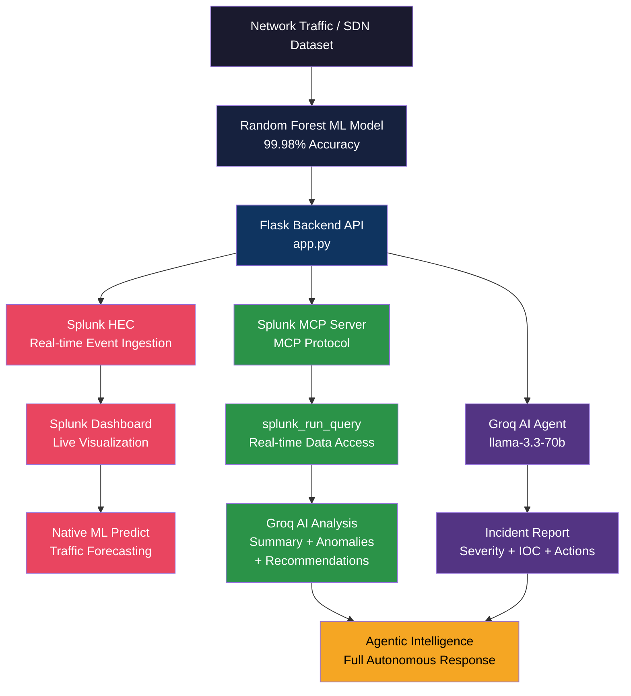

# Architecture Diagram

## Autonomous DDoS Detection & Response System

```mermaid
flowchart TD
    A[Network Traffic / SDN Dataset] --> B[Random Forest ML Model\n99.98% Accuracy]
    B --> C[Flask Backend API\napp.py]
    C --> D[Splunk HEC\nReal-time Event Ingestion]
    C --> E[Groq AI Agent\nllama-3.3-70b]
    C --> F[Splunk MCP Server\nMCP Protocol]
    D --> G[Splunk Dashboard\nLive Visualization]
    G --> H[Native ML Predict\nTraffic Forecasting]
    F --> I[splunk_run_query\nReal-time Data Access]
    I --> J[Groq AI Analysis\nSummary + Anomalies\n+ Recommendations]
    E --> K[Incident Report\nSeverity + IOC + Actions]
    J --> L[Agentic Intelligence\nFull Autonomous Response]
    K --> L

    style A fill:#1a1a2e,color:#fff
    style B fill:#16213e,color:#fff
    style C fill:#0f3460,color:#fff
    style D fill:#e94560,color:#fff
    style E fill:#533483,color:#fff
    style F fill:#2b9348,color:#fff
    style G fill:#e94560,color:#fff
    style H fill:#e94560,color:#fff
    style I fill:#2b9348,color:#fff
    style J fill:#2b9348,color:#fff
    style K fill:#533483,color:#fff
    style L fill:#f5a623,color:#000
```
