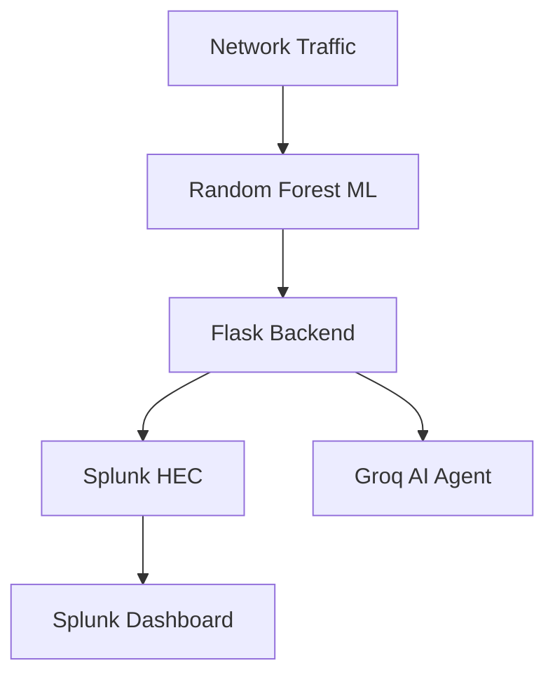

# Architecture Diagram

```mermaid
flowchart TD
    A[Network Traffic] --> B[Random Forest ML]
    B --> C[Flask Backend]
    C --> D[Splunk HEC]
    D --> E[Splunk Dashboard]
    C --> F[Groq AI Agent]
```
